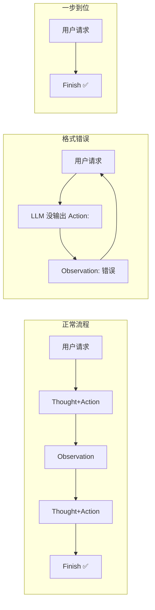

# Agent Loop (ReAct 模式) 流程图

> 对应文件：`agent_loop.py`

```mermaid
flowchart TD
    START(["🚀 run_agent(用户请求)"]) --> INIT["📋 初始化 prompt_history<br/>prompt_history = [用户请求]"]
    INIT --> LOOP{"🔁 循环 (最多 5 轮)<br/>i &lt; max_iterations ?"}

    LOOP -->|是| BUILD["📝 3.1 构建 Prompt<br/>full_prompt = '\n'.join(prompt_history)"]
    BUILD --> LLM["🤖 3.2 调用 LLM<br/>llm_output = llm.generate(full_prompt)"]

    LLM --> TRUNC["✂️ 正则① 截断多余的 Thought-Action"]
    TRUNC --> APPEND1["📥 追加 llm_output 到 prompt_history"]

    APPEND1 --> PARSE{"🔍 3.3 正则② 提取 Action<br/>能匹配到 'Action: ...' ?"}

    PARSE -->|否| ERR1["⚠️ Observation: 错误<br/>追加到 prompt_history"]
    ERR1 --> LOOP

    PARSE -->|是| CHECK{"3.4 action_str 以 'Finish' 开头?"}

    CHECK -->|是| FINISH["✅ 正则③ 提取最终答案<br/>return final_answer"]
    FINISH --> END(["🏁 结束"])

    CHECK -->|否| TOOL{"3.5 正则④⑤⑥<br/>解析工具名 + 参数<br/>工具在 available_tools 中?"}

    TOOL -->|否| ERR2["⚠️ Observation: 未定义的工具<br/>追加到 prompt_history"]
    ERR2 --> LOOP

    TOOL -->|是| EXEC["⚡ 3.6 调用工具<br/>observation = tool(**kwargs)"]
    EXEC --> OBS["📊 3.7 Observation<br/>追加到 prompt_history"]
    OBS --> LOOP

    LOOP -->|否 (超过 5 轮)| FAIL["❌ 达到最大循环次数"]
    FAIL --> END

    style START fill:#4CAF50,color:white
    style END fill:#4CAF50,color:white
    style LLM fill:#FF9800,color:white
    style EXEC fill:#2196F3,color:white
    style FINISH fill:#9C27B0,color:white
    style FAIL fill:#F44336,color:white
    style OBS fill:#00BCD4,color:white
    style LOOP fill:#607D8B,color:white
```

## 核心概念对照

| ReAct 论文术语 | 代码中的对应 | 职责 |
|---------------|-------------|------|
| **Reasoning** (推理) | `llm.generate()` → `Thought:` | 模型分析当前信息，决定下一步 |
| **Acting** (行动) | `available_tools[tool_name](**kwargs)` | 执行模型选择的工具 |
| **Observation** (观察) | 工具返回值 → `Observation: ...` | 将环境反馈告诉模型 |
| **Loop** (循环) | `for i in range(max_iterations)` | 重复 Thought→Action→Obs 直到 Finish |

## prompt_history 的增长过程（以旅游助手为例）

```
第 1 轮前:
  ┌─────────────────────────────┐
  │ 用户请求: 查北京天气推荐景点  │
  └─────────────────────────────┘

第 1 轮 LLM 输出 → 追加:
  ┌─────────────────────────────┐
  │ Thought: 需要先查询天气      │
  │ Action: get_weather(city="北京") │
  └─────────────────────────────┘

第 1 轮 工具执行 → 追加:
  ┌─────────────────────────────┐
  │ Observation: 北京晴天, 25°C  │
  └─────────────────────────────┘

第 2 轮 LLM 输出 → 追加:
  ┌─────────────────────────────┐
  │ Thought: 晴天适合户外景点    │
  │ Action: get_attraction(city="北京", weather="晴") │
  └─────────────────────────────┘

第 2 轮 工具执行 → 追加:
  ┌─────────────────────────────┐
  │ Observation: 推荐故宫、颐和园 │
  └─────────────────────────────┘

第 3 轮 LLM 输出:
  ┌─────────────────────────────┐
  │ Thought: 信息足够，给出答案  │
  │ Action: Finish[北京晴天25度，推荐去故宫] │
  └─────────────────────────────┘
  → ✅ return 最终答案
```

## 三种可能的路径



> **要点**：ReAct = 模型"想一步 + 做一步 + 看结果"，循环直到信息够了。每一步都有 Thought 记录推理过程，每一步 Action 都调用真实工具获取事实，拒绝幻觉。
